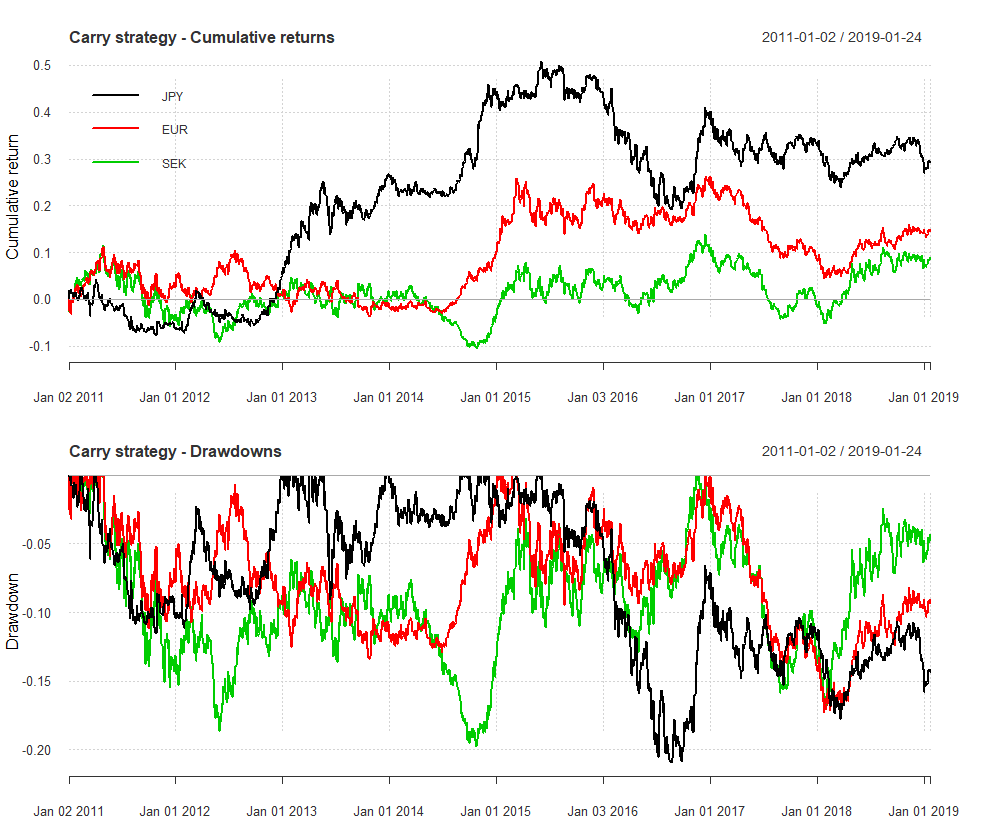

[](http://quantlet.de/)

## [](http://quantlet.de/) **CarryStrategyFX** [](http://quantlet.de/)

```yaml

Name of Quantlet : CarryStrategyFX

Published in : 'Currency hedging for SMEs and pension funds'

Description : 'Contains the Carry trade strategy for foreign exchanges, which involves borrowing and subsequently selling a low-interest currency to fund the purchase of a higher-yielding currency.'

Keywords : 
 - fx trading
 - carry portfolio
 - carry arbitrage
 - FOREX
 - interest rate differentials 
 - FAMA 
 - forward premium 

See also : 

Author : Joerg Osterrieder, Piotr Kotlarz 

Submitted :  Fri, Wed 13 2019 by Joerg Osterrieder and Piotr Kotlarz 

Datafile : Data.RData, CarryFunctions.R, CarryPackages.R, CarryStrategyFX.R

Example: Performance of carry strategy for EUR/USD, SEK/USD and JPY/USD from 01-01-2011 to 25-01-2019 with daily frequency
```



### R Code
```r

# please change your working directory setwd('C:/...')
# load the data, functions and packages 

source("CarryPackages.R")
source("CarryFunctions.R")

# Load the data 
load("data/Data.RData")

Backtest = carry(crncy=c("JPY", "EUR", "SEK"), start_date ="2011-01-01", end_date = "2019-01-25", nfwd = 1)

  par(mfrow=c(2,1))
  chart.CumReturns(Backtest, legend.loc = "topleft", main = "Carry strategy - Cumulative returns")
  title(ylab = "Cumulative return")
  chart.Drawdown(Backtest, main = "Carry strategy - Drawdowns", ylab ="Value in percent")
  title(ylab = "Drawdown") 


```

automatically created on 2019-02-26
