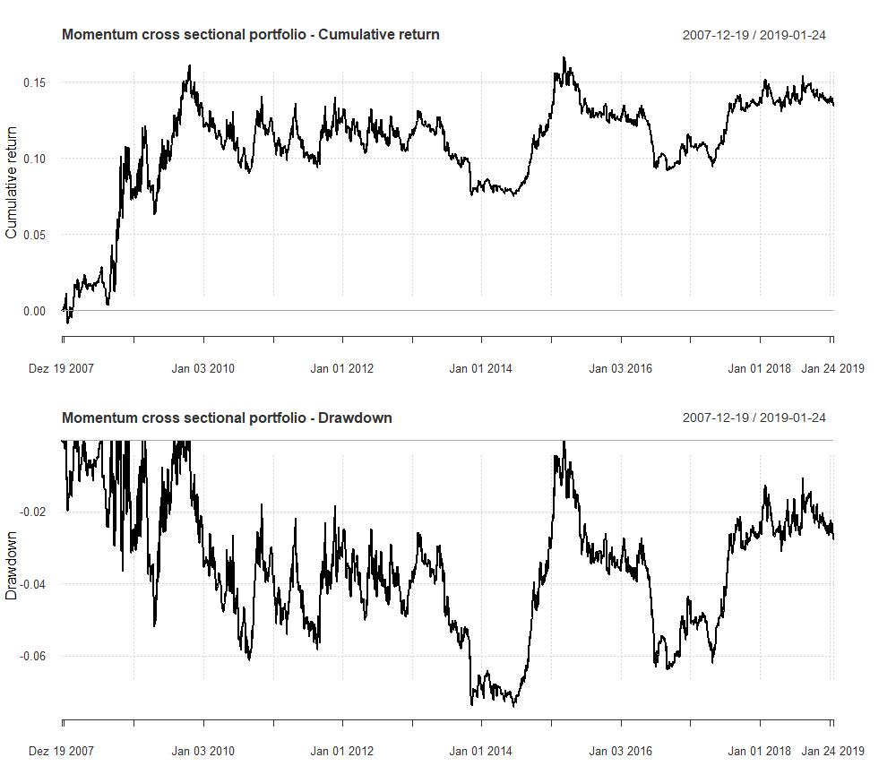

[](http://quantlet.de/)

## [](http://quantlet.de/) **MomentumStrategyFX** [](http://quantlet.de/)

```yaml

Name of Quantlet : MomentumStrategyFX

Published in : 'Currency hedging for SMEs and pension funds'

Description : 'Contains the Momentum strategy for the cross-sectional portfolio. For our approach, we apply the algorithm presented 
by Baz et al. (2015) to generate the momentum signal, based on three crossovers of exponential moving averages with different 
time horizons. The three different crossovers identify short-, medium-, and long-term trends respectively. A signal is generated for 
each time horizon and then all these signals are combined to build a trade signal. Based on the generated trading signals, 
we create the portfolio with weights prespecified by user.'  
 
Keywords : 
 - fx trading
 - momentum
 - cross sectional-portfolio
 - FOREX
 - trend prediction 

See also : 

Author : Joerg Osterrieder, Piotr Kotlarz 

Submitted :  Wed, 27 2019 by Joerg Osterrieder and Piotr Kotlarz 

Datafile : Data.RData, MomentumFunctions.R, MomentumPackages.R, MomentumStrategyFX.R

Example: 'Performance of momentum cross-sectional portfolio for a sample of the following currencies: 
EUR, AUD, NZD, JPY, CZK, PLN, CNY, CHF, GBP, CZK, SEK quoted against USD from December 2007 to January 2019.' 

```



### R Code
```r

rm(list = ls(all = TRUE))

# please change your working directory setwd('C:/...')
# load the data, functions and packages 

source("MomentumPackages.R")
source("MomentumFunctions.R")

# Load the data 
load("data/Data.RData")

# Specify parameters 
start_date = "2007-01-01"
end_date = "2019-01-25"
crncy = c("EUR","AUD","NZD","JPY","CZK","PLN","CNY","CHF", "GBP", "CZK")
S_k = c(8,16,32)
L_k = c(24,48,96)
n1 = 63
n2 = 252
w = c(0.3,0.3,0.4)

# Run backtest
Backtest = strategy(crncy = crncy, start_date, end_date, S_k = S_k, L_k = L_k, n1 = n1, n2 = n2, w = w)

# Generate plots 
par(mfrow=c(2,1))
chart.CumReturns(Backtest$portfolio, main = "Momentum cross sectional portfolio - Cumulative return")
title(ylab = "Cumulative return")
chart.Drawdown(Backtest$portfolio, main = "Momentum cross sectional portfolio - Drawdown")
title(ylab = "Drawdown") 


```

automatically created on 2019-02-26
